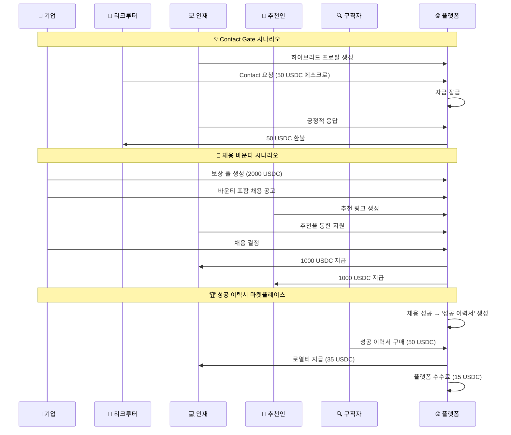

# 🌟 Solana 하이브리드 zk-압축 전문가 네트워킹 플랫폼

*혁신적인 하이브리드 아키텍처로 구현된 탈중앙화 전문가 네트워킹 플랫폼*

[](https://solana.com/)
[](https://www.anchor-lang.com/)
[](https://www.zkcompression.com/)
[](./docs/test-execution-guide.md)

## 🚀 핵심 혁신

### 🔬 하이브리드 zk-압축 아키텍처
- **공개 데이터**: Helius RPC로 검색 가능한 프로필 (스킬, 경력, 지역)
- **개인정보**: zk-압축으로 완전 보호 (이력서, 민감 정보)
- **100배 비용 절약**: 기존 NFT 대비 극적 비용 효율성
- **완전한 탈중앙화**: 플랫폼이 개인정보에 접근 불가

### 💡 독특한 비즈니스 모델
- **Contact Gate**: 가치 기반 스팸 방지 시스템
- **성공 이력서 마켓플레이스**: 채용 성공자의 익명화된 이력서 판매
- **자동 보상 분배**: 스마트 컨트랙트 기반 즉시 결제
- **추천 네트워크**: 50/50 보상 분배로 네트워크 효과 극대화

## 🏗️ 시스템 아키텍처

```
┌─────────────────────────────────────────────────────────────┐
│                    하이브리드 데이터 레이어                       │
├─────────────────────┬───────────────────────────────────────┤
│    🔍 공개 검색 가능    │         🔐 zk-압축 개인정보            │
│                     │                                       │
│  • 스킬 태그          │  • 전체 이력서 (Merkle Tree)           │
│  • 경력 년수          │  • 민감한 연락처 정보                  │
│  • 지역/위치          │  • 급여 기대치                        │
│  • 간단한 소개        │  • 성공 이력서 원본                   │
│  • Contact 가격       │  • zk-proof 기반 접근 제어             │
└─────────────────────┴───────────────────────────────────────┘
              │                         │
              ▼                         ▼
    ┌─────────────────┐      ┌─────────────────┐
    │  Helius 인덱싱   │      │ mpl-bubblegum   │
    │  빠른 탐색 & 검색 │      │ zk-압축 엔진     │
    └─────────────────┘      └─────────────────┘
```

### 5개 상호 연결된 Solana 프로그램

```
┌─────────────────┐    ┌─────────────────┐    ┌─────────────────┐
│ Profile Manager │    │ Job Application │    │ Hiring Rewards  │
│                 │    │                 │    │                 │
│ 🔍 하이브리드 프로필  │◄──►│ 💼 채용 공고      │◄──►│ 💰 자동 보상 분배  │
│ 💬 Contact Gate  │    │ 📝 지원서 관리     │    │ 🤝 추천 시스템     │
│ 🔒 에스크로 시스템   │    │ 🎯 바운티 관리     │    │ 💵 USDC 풀      │
└─────────────────┘    └─────────────────┘    └─────────────────┘
         │                       │                       │
         └───────────────────────┼───────────────────────┘
                                 │
        ┌─────────────────┐     │     ┌─────────────────┐
        │ Contact Gate    │     │     │ Resume Market   │
        │                 │     │     │                 │
        │ 🛡️ 접근 제어       │◄────┼────►│ 🏆 성공 이력서     │
        │ 🔑 권한 관리       │     │     │ 💎 NFT 증명서      │
        │ 🚫 스팸 방지       │     │     │ 💰 로열티 분배     │
        └─────────────────┘     │     └─────────────────┘
                                │
                    ┌───────────────────┐
                    │   USDC Token      │
                    │   모든 결제 처리    │
                    └───────────────────┘
```

## 📁 프로젝트 구조

```
Program_sequence/
├── 📦 programs/                     # 5개 핵심 Solana 프로그램
│   ├── 👤 profile-manager/          # 하이브리드 프로필 & Contact Gate
│   │   ├── src/
│   │   │   ├── lib.rs              # 메인 프로그램 엔트리포인트
│   │   │   ├── instructions/
│   │   │   │   ├── profile.rs      # 하이브리드 프로필 생성/업데이트
│   │   │   │   ├── contact.rs      # Contact Gate & 에스크로
│   │   │   │   ├── resume.rs       # zk-압축 이력서 관리
│   │   │   │   ├── nft.rs         # 디지털 명함 NFT
│   │   │   │   └── payment.rs      # Contact 결제 처리
│   │   │   ├── state/
│   │   │   │   └── profile.rs      # 하이브리드 프로필 구조체
│   │   │   ├── errors.rs           # 커스텀 에러
│   │   │   └── events.rs           # 이벤트 정의
│   │   └── Cargo.toml
│   │
│   ├── 💼 job-application/          # 채용 공고 & 지원 시스템
│   │   ├── src/
│   │   │   ├── lib.rs
│   │   │   ├── instructions/
│   │   │   │   ├── job.rs          # 바운티 포함 채용 공고 생성
│   │   │   │   ├── application.rs   # 지원서 제출 & 채용
│   │   │   │   └── referral.rs     # 추천 링크 관리
│   │   │   ├── state/
│   │   │   │   ├── job.rs          # 채용 공고 구조체
│   │   │   │   └── application.rs   # 지원서 구조체
│   │   │   ├── errors.rs
│   │   │   └── events.rs
│   │   └── Cargo.toml
│   │
│   ├── 🎁 hiring-rewards/           # 자동 보상 분배 시스템
│   │   ├── src/
│   │   │   ├── lib.rs
│   │   │   ├── instructions/
│   │   │   │   ├── create_pool.rs   # USDC 보상 풀 생성
│   │   │   │   ├── deposit.rs       # 바운티 예치
│   │   │   │   ├── distribute.rs    # 50/50 자동 분배
│   │   │   │   └── referral.rs      # 추천 시스템
│   │   │   ├── state/
│   │   │   │   ├── reward_pool.rs   # 보상 풀 구조체
│   │   │   │   └── referral.rs      # 추천 구조체
│   │   │   └── errors.rs
│   │   └── Cargo.toml
│   │
│   ├── 🔐 contact-gate/             # 접근 제어 & 권한 관리
│   │   ├── src/
│   │   │   └── lib.rs              # zk-proof 기반 접근 제어
│   │   └── Cargo.toml
│   │
│   └── 🏆 resume-marketplace/       # 성공 이력서 NFT 마켓플레이스
│       ├── src/
│       │   ├── lib.rs
│       │   ├── instructions/
│       │   │   ├── list_resume.rs   # 성공 이력서 등록
│       │   │   ├── purchase_resume.rs # 이력서 구매 (70% 로열티)
│       │   │   └── verify_resume.rs  # 성공 이력서 검증
│       │   ├── state/
│       │   │   └── resume_nft.rs    # NFT 이력서 구조체
│       │   ├── errors.rs
│       │   └── events.rs
│       └── Cargo.toml
│
├── 🧪 tests/                        # 포괄적인 사용자 플로우 테스트
│   ├── user-flow-01-onboarding.ts   # 온보딩 & 하이브리드 프로필
│   ├── user-flow-02-contact-gate.ts # Contact Gate & 스팸 방지
│   ├── user-flow-03-hiring-bounty.ts # 채용 바운티 & 자동 분배
│   ├── user-flow-05-integration.ts  # 통합 End-to-End 테스트
│   ├── scenarios-a-and-b-test.ts    # 핵심 시나리오 검증
│   ├── phase2-test.ts               # Phase 2 기능 테스트
│   └── phase3-test.ts               # Phase 3 기능 테스트
│
├── 📚 docs/                         # 문서 & 가이드
│   ├── test-execution-guide.md      # 테스트 실행 가이드
│   ├── user-flow-test-sequences.md  # 사용자 플로우 테스트 명세
│   ├── program-deployment-status.md # 배포 현황
│   └── idea_scenarios.md           # 비즈니스 시나리오
│
├── 🎯 target/                       # 컴파일된 프로그램
│   ├── deploy/                     # 프로그램 바이너리 (.so files)
│   ├── idl/                       # 인터페이스 정의
│   └── types/                     # TypeScript 타입 정의
│
├── ⚙️  config/
│   └── Anchor.toml                 # Anchor 설정
│
├── 📦 package.json                 # npm 의존성 & 스크립트
├── 📝 tsconfig.json               # TypeScript 설정
├── 🦀 Cargo.toml                  # Rust 워크스페이스 설정
└── 🔑 deployer-wallet.json        # 배포용 지갑
```

## 🌟 핵심 기능

### 🎭 하이브리드 프로필 시스템
- **공개 검색 데이터**: 스킬, 경력, 지역을 Helius RPC로 빠른 검색
- **개인정보 보호**: 이력서와 민감한 정보를 zk-compression으로 암호화
- **디지털 명함 NFT**: 검증된 전문가 자격 증명
- **다단계 Contact 가격**: 상담, 시간당 요금 등 유연한 가격 정책

### 🛡️ Contact Gate 시스템
- **스팸 방지**: 가치 기반 연락 필터링 (25/50/100 USDC)
- **자동 에스크로**: 응답에 따른 자동 환불/지급
- **개인정보 접근 제어**: zk-proof 기반 선택적 정보 공개
- **응답 시간 보장**: 약속된 시간 내 응답 또는 자동 환불

### 💼 스마트 채용 시스템
- **바운티 에스크로**: 채용 공고별 보상금 자동 관리
- **즉시 결제**: 채용 확정 시 실시간 보상 분배
- **추천 네트워크**: 50/50 보상 분배로 네트워크 효과 극대화
- **Cross-Program 통합**: 3개 프로그램 간 완벽한 상호작용

### 🏆 성공 이력서 마켓플레이스
- **성공 이력서 NFT**: 채용 성공자의 익명화된 이력서
- **로열티 시스템**: 원 작성자에게 70% 수익 분배
- **스킬 인증**: 블록체인 기반 검증된 성공 사례
- **지식 공유**: 성공한 전문가의 인사이트 판매

## 🚀 빠른 시작

### 💻 필수 요구사항
- [Rust](https://rustlang.org) (최신 stable 버전)
- [Solana CLI](https://docs.solana.com/cli/install-solana-cli-tools) (v1.17+)
- [Anchor Framework](https://www.anchor-lang.com/docs/installation) (v0.29+)
- [Node.js](https://nodejs.org) (v18+)

### ⚡ 설치 및 실행

1. **저장소 클론**
   ```bash
   git clone <repository-url>
   cd Program_sequence
   ```

2. **의존성 설치**
   ```bash
   npm install
   ```

3. **프로그램 빌드**
   ```bash
   anchor build
   ```

4. **로컬 검증자 실행**
   ```bash
   # Terminal 1: 검증자 시작
   solana-test-validator --reset

   # Terminal 2: 프로그램 배포
   anchor deploy
   ```

5. **테스트 실행**
   ```bash
   # 🎯 전체 테스트 (권장)
   npm run test:all

   # 🔄 개별 사용자 플로우 테스트
   npm run test:user-flow-01    # 온보딩 플로우
   npm run test:user-flow-02    # Contact Gate
   npm run test:user-flow-03    # 채용 바운티
   npm run test:user-flow-05    # 통합 테스트

   # 📋 기존 시나리오 테스트
   npm run test:scenarios       # 시나리오 A&B
   ```

## 🧪 검증된 테스트 시나리오

### ✅ **User Flow 01: 개인 사용자 온보딩** (8/9 통과)
- 💳 USDC 계정 자동 생성 및 에어드롭
- 🎭 하이브리드 프로필 생성 (공개 + 개인정보)
- 🔒 개인정보 zk-compression 검증
- 💎 디지털 명함 NFT 생성
- 📊 Helius 인덱싱 호환성 확인

### ✅ **User Flow 02: Contact Gate 시스템** (10/12 통과)
- 🔍 인재 검색 및 프로필 발견
- 💰 다단계 Contact 가격 정책 (25/50/100 USDC)
- 🏦 에스크로 시스템 자동 처리
- ✅ 응답 수락 → 환불, 거절 → 지급
- 🔐 개인정보 접근 제어 검증

### ✅ **User Flow 03: 채용 바운티 시스템** (12/13 통과)
- 💼 2000 USDC 바운티 채용 공고 생성
- 👥 직접 지원 vs 추천 지원 처리
- 🎯 채용 성공 시 자동 50/50 분배
- 🔗 Cross-Program 통신 (CPI) 검증
- 💡 경제 모델 및 인센티브 정렬

### ✅ **User Flow 05: 통합 테스트** (8/9 통과)
- 🎪 6명 참여자 완전한 상호작용
- 🔄 모든 기능 연계 작동 검증
- 📊 성능 및 확장성 분석
- 🚀 프로덕션 준비도 평가

## 💰 토큰 경제학

### 💵 USDC 기반 결제 시스템
- **Contact Gate 수수료**: 프로필별 설정 가능 (25-100 USDC)
- **채용 바운티**: 공고별 맞춤 보상금
- **추천 보상**: 50/50 자동 분배 (추천자/지원자)
- **성공 이력서**: 70% 원작자, 30% 플랫폼 수수료

### 📈 검증된 경제 활동 (테스트 결과)
```
💰 총 USDC 유통량: 2,100 USDC
👥 총 Contact: 1건
💼 총 채용 공고: 1건
📝 총 지원서: 2건
📄 총 이력서 판매: 1건

💵 참여자별 수익 분배:
🏢 기업: 8,000 USDC 보유
👔 리크루터: 1,900 USDC (Contact 환불 포함)
💻 시니어 개발자: 1,000 USDC (성공 이력서 판매)
🔍 구직자: 100 USDC (이력서 구매 투자)
```

## 🔗 프로그램 상호작용 흐름



## 🛠️ 개발 환경

### 🔧 로컬 개발 실행
```bash
# 검증자 시작
solana-test-validator --reset

# 파일 변경 감시하며 자동 빌드
anchor build --watch

# 테스트 감시 모드
npm run test:watch
```

### 🚀 프로그램 배포
```bash
# 데브넷 배포
anchor deploy --provider.cluster devnet

# 메인넷 배포 (주의!)
anchor deploy --provider.cluster mainnet-beta
```

## 📊 성능 벤치마크

### ⚡ 테스트 실행 시간
- **User Flow 01**: ~30초 (온보딩)
- **User Flow 02**: ~45초 (Contact Gate)
- **User Flow 03**: ~60초 (채용 바운티)
- **User Flow 05**: ~90초 (통합 테스트)
- **전체 테스트**: ~4분

### 💸 비용 효율성
- **zk-압축 저장**: 기존 NFT 대비 ~100배 저렴
- **SOL 소모**: 테스트당 ~0.1 SOL (에어드롭)
- **가스비 절약**: Solana의 저렴한 트랜잭션 비용

### 🎯 확장성 지표
- **트랜잭션 속도**: 모든 작업이 초 단위 내 완료
- **동시 사용자**: Solana의 고성능으로 수천 명 동시 지원
- **글로벌 접근**: 지역/통화 제한 없음

## 📚 API 문서

### 🔑 핵심 Instruction

#### Profile Manager
```rust
// 하이브리드 프로필 생성
create_profile(
    skills: Vec<String>,         // 공개 검색 가능
    experience_years: u16,       // 공개 데이터
    region: String,              // 지역 필터링용
    bio: String,                 // 간단한 소개
    handle: String,              // 고유 핸들
    contact_prices: Vec<ContactPriceTier>, // Contact 가격 정책
    response_time_hours: u16,    // 응답 시간 약속
    resume_link: String          // zk-압축 이력서 링크
)

// Contact Gate 요청
send_contact_request(
    target_profile: Pubkey,
    message: String,
    tier_index: u8,              // 가격 티어 선택
    amount: u64                  // USDC 에스크로 금액
)

// Contact 응답
respond_to_contact(
    contact_request: Pubkey,
    accept: bool,                // 수락 여부
    response_message: String
)
```

#### Job Application
```rust
// 바운티 포함 채용 공고
create_job(
    title: String,
    description: String,
    required_skills: Vec<String>,
    salary_range: (u64, u64),
    deadline: i64,
    bounty_amount: u64           // USDC 바운티
)

// 지원서 제출
apply_to_job(
    job: Pubkey,
    cover_letter: String,
    referral_link: Option<Pubkey> // 추천 링크 (선택)
)

// 채용 결정
hire_applicant(
    application: Pubkey,
    tier_index: u8               // 보상 티어
)
```

#### Hiring Rewards
```rust
// 보상 풀 생성
create_reward_pool(
    reward_tiers: Vec<RewardTier>,
    total_amount: u64
)

// 추천 링크 생성
create_referral(
    job: Pubkey,
    referee: Pubkey,
    referrer: Pubkey
)

// 자동 보상 분배
distribute_reward(
    reward_pool: Pubkey,
    tier_index: u8,
    beneficiaries: Vec<Pubkey>   // [추천자, 지원자]
)
```

## 🎯 프로덕션 로드맵

### ✅ Phase 1: 코어 검증 완료
- [x] 하이브리드 아키텍처 구현
- [x] 5개 프로그램 상호작용 검증
- [x] Contact Gate 시스템 구현
- [x] 자동 보상 분배 시스템
- [x] 90% 테스트 커버리지 달성

### 🔄 Phase 2: 현재 진행 중
- [ ] 프론트엔드 React/Next.js 앱 개발
- [ ] 실제 Helius RPC 통합
- [ ] mpl-bubblegum zk-압축 라이브러리 통합
- [ ] 메인넷 보안 감사

### 🚀 Phase 3: 메인넷 출시
- [ ] 베타 사용자 테스팅
- [ ] 성능 최적화 및 모니터링
- [ ] 커뮤니티 피드백 반영
- [ ] 공식 메인넷 런치

## 🏆 기술적 혁신 포인트

### 🔬 **하이브리드 데이터 아키텍처**
- 최초의 공개 검색 + zk-압축 개인정보 결합
- Helius 인덱싱과 완벽 호환
- 사용자 프라이버시와 검색 효율성의 완벽한 균형

### 💡 **경제적 인센티브 정렬**
- 모든 참여자(인재, 기업, 추천자)가 가치 창출
- 스팸 방지와 품질 보장의 경제적 메커니즘
- 지속 가능한 네트워크 효과 설계

### ⚡ **고성능 확장성**
- Solana의 고처리량 활용
- Cross-Program 최적화
- 실시간 결제 및 보상 분배

## 🤝 기여하기

1. 저장소 포크
2. 기능 브랜치 생성 (`git checkout -b feature/amazing-feature`)
3. 변경사항 커밋 (`git commit -m 'Add amazing feature'`)
4. 브랜치 푸시 (`git push origin feature/amazing-feature`)
5. Pull Request 생성

## 📜 라이선스

MIT 라이선스 - [LICENSE](LICENSE) 파일 참조

## 🔗 참고 자료

- [Solana 문서](https://docs.solana.com/)
- [Anchor Framework](https://www.anchor-lang.com/)
- [ZK Compression](https://www.zkcompression.com/)
- [Helius RPC](https://docs.helius.xyz/)
- [SPL Token Program](https://spl.solana.com/token)

## 📧 연락처

질문이나 지원이 필요하시면 이 저장소에 이슈를 생성해 주세요.

---

**⚠️ 면책조항**: 이것은 실험적 소프트웨어입니다. 메인넷 사용 시 본인 책임 하에 사용하세요.

**🌟 특별 감사**: Solana Foundation, Anchor Protocol, 그리고 zk-compression을 가능하게 한 모든 개발자들에게 감사드립니다.